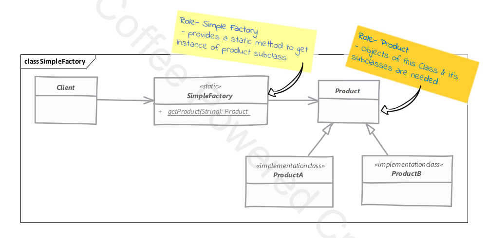
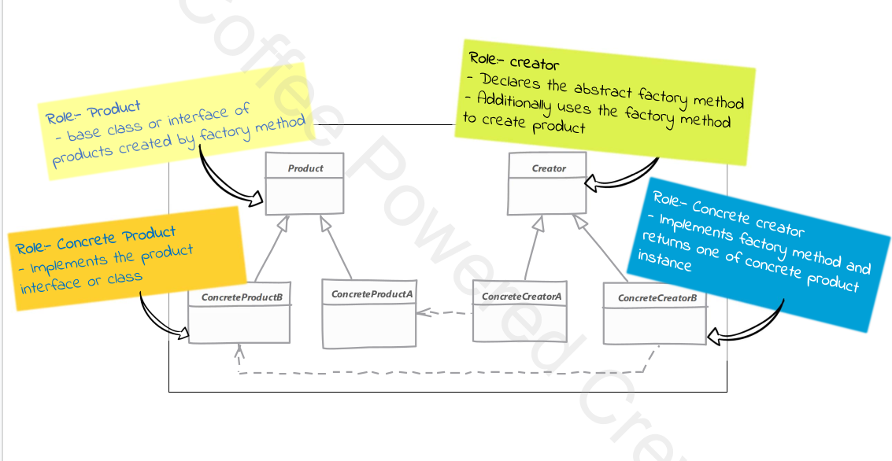

# Builder Design Pattern
Builder Pattern Solves the following problems:
* Class constructor requites a lot of information
* Class instances should be immutable
* Creating Complex Objects that need other objects or "parts" to construct them

This is the uml of builder pattern:

## Implementation Considerations
* You can creat an immutable class by implementing builder as an inner static class
* Director role is rarely implemented as a separate class, typically the consumer of the object instance or the client handles that role
* Abstract builder is also not required.
* If you're running into a "too many constructor arguments" problem then you might need tho use builder!

## Pitfalls
* A little complex mainly because of method changing 

# Simple Factory Pattern
When Multiple types can be instantiated and the choice is based on some simple criteria

## Pitfalls
* Situation can get complicated and complex. For this situations you should use factory method

# Factory Method Pattern
* We want to move the object creation logic from our code to a separate class.
* We don't know in advance which class we may need to instantiate beforehand and also allow new classes to be added
 to system and handle their creation without affecting client code.
* We let subclasses decide which object to instantiate by overriding the factory method

## Pitfalls
* More complex to implement. More classes involved and need unit testing
* You have to start with factory method from the beginning. It's not easy to refactor existing code into factory method pattern
* Sometimes this pattern forces you to subclass just to create appropriate instance.
 

