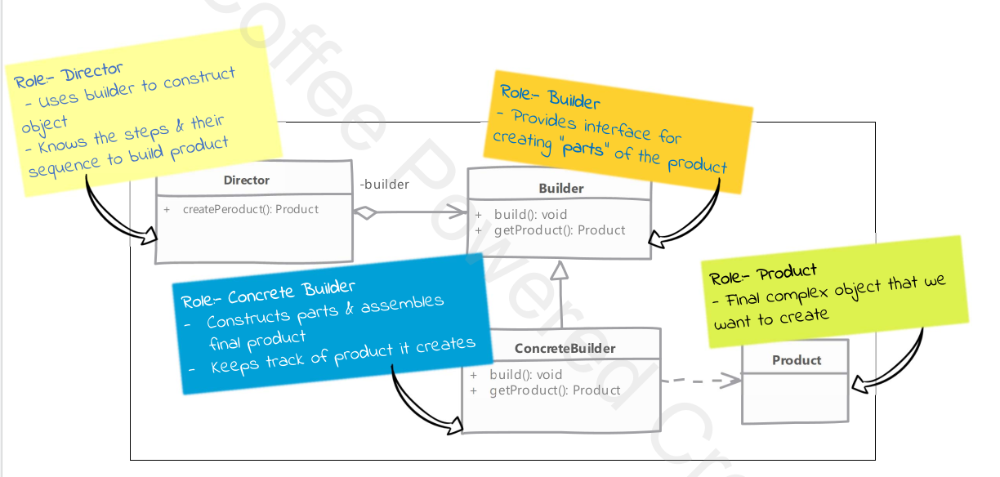

# Builder Design Pattern
Builder Pattern Solves the following problems:
* Class constructor requites a lot of information
* Class instances should be immutable
* Creating Complex Objects that need other objects or "parts" to construct them

This is the uml of builder pattern:

## Implementation Considerations
* You can creat an immutable class by implementing builder as an inner static class
* Director role is rarely implemented as a separate class, typically the consumer of the object instance or the client handles that role
* Abstract builder is also not required.
* If you're running into a "too many constructor arguments" problem then you might need tho use builder!

##Pitfalls
* A little complex mainly because of method changing 
